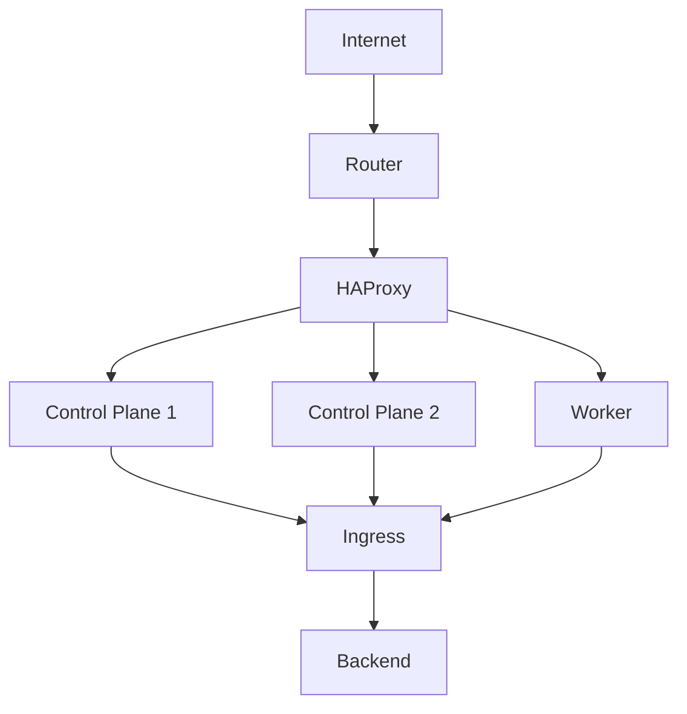

# Platform Architecture

## Overview

`jdwlabs/platform` is a tenant-centric GitOps platform managing Kubernetes applications via ArgoCD. It enforces tenant boundaries, namespace isolation, and standardized resource controls.

## Repository Layout

```
platform/
├── bootstrap/        # ArgoCD ApplicationSets and AppProjects
├── platform/         # Shared infrastructure apps (cluster-wide)
├── tenants/          # Per-tenant configurations (ARC runners, database schemas)
├── helm-charts/      # Custom, versioned Helm charts (porkbun-webhook, openclaw)
└── docs/             # Documentation
```

## Chart Management & Publishing
The platform manages custom Helm charts in the `helm-charts/` directory. These are versioned and published automatically to a GitHub Pages-hosted Helm repository:

- **Helm Repo URL**: `https://jdwlabs.github.io/platform/`
- **Automation**: Managed by the `.github/workflows/release.yaml` workflow, which packages charts and updates the repository index on every `main` branch push.

## Bootstrap surface

`platformctl` is the only entry point for cluster lifecycle operations.
It coordinates these four surfaces:

```
platformctl
  ├─ Helm exec ─────────────► Kubernetes API (argocd install in phase 1)
  ├─ Dynamic client ─────────► Kubernetes API (Applications, AppProjects, ApplicationSets)
  ├─ Vault HTTP API ─────────► Vault (init, unseal, kv-v2 read/write)
  └─ Embedded YAML ──────────► bootstrap/root-app.yaml (in-memory --branch patch)
```

All four surfaces are read by both `bootstrap` and `bootstrap verify`;
mutating phases (1–5) write to them. `bootstrap heal` subcommands target
specific surfaces directly to recover from known-bad states.

## ArgoCD Model

### Governance ApplicationSet (`bootstrap/governance-appset.yaml`)
- Scans `tenants/*/tenant.yaml` via git file generator.
- Renders `helm-charts/tenant-envelope` for each tenant.
- Generates per-tenant `<name>-services` and `<name>-deployments` ApplicationSets.

### `extraSourceRepos` and multi-source Apps

When a tenant's ArgoCD AppProject must reference more than one source
repo (e.g. tenant uses `helm-charts/openclaw` from this repo and also
needs its private deployment manifests from `<tenant>/deployments`),
declare additional repos in `tenant.yaml`:

```yaml
project:
  extraSourceRepos:
    - https://github.com/jdwlabs/platform.git
```

Failure to set this causes ArgoCD to reject the Application with "repo
not permitted" errors.

### Services Deployment
Services use versioned Helm charts from the repository:
```yaml
# tenants/jdwlabs/tenant.yaml
services:
  - name: openclaw
    chart: openclaw
    repo: https://jdwlabs.github.io/platform/
    revision: 0.1.15
```

## Traffic Routing
Traffic flows through DNS ➜ Router (NAT) ➜ HAProxy ➜ NGINX Gateway Fabric (NodePort) ➜ Backend Pods.

```
┌─────────────────────────────────────────────┐
│                  Internet                   │
└─────────────────────────────────────────────┘
                       │                       
              DNS: *.jdwlabs.com               
              CNAME ➜ jdwlabs.com              
            A ➜ <router public IP>             
                       │                       
                       ▼                       
┌─────────────────────────────────────────────┐
│          Router (NAT/Port Forward)          │
│                                             │
│             :80  ➜ <haproxy>:80             │
│            :443 ➜ <haproxy>:443             │
└─────────────────────────────────────────────┘
                       │                       
                       ▼                       
┌─────────────────────────────────────────────┐
│       HAProxy (Static IP, bare-metal)       │
│                                             │
│         :80/:443  ➜  nginx-gateway          │
│         :6443     ➜  Kubernetes API         │
│           :50000    ➜  Talos API            │
│         :9000     ➜  HAProxy stats          │
└─────────────────────────────────────────────┘
                       │                       
        ┌──────────────┼──────────────┐        
        │              │              │        
        ▼              ▼              ▼        
┌─────────────┐ ┌─────────────┐ ┌─────────────┐
│   Control   │ │   Control   │ │    Worker   │
│    Plane    │ │    Plane    │ │    Node     │
│             │ │             │ │             │
│ :30180 HTTP │ │ :30180 HTTP │ │ :30180 HTTP │
│ :30543 HTTPS│ │ :30543 HTTPS│ │ :30543 HTTPS│
│ :6443  K8s  │ │ :6443  K8s  │ │             │
│ :50000Talos │ │ :50000Talos │ │             │
└──────┬──────┘ └──────┬──────┘ └──────┬──────┘
       │               │               │       
       └───────────────┼───────────────┘       
                       │                       
             kube-proxy (iptables)             
               routes to pod IP                
                       │                       
                       ▼                       
┌─────────────────────────────────────────────┐
│          nginx-gateway-fabric Pod           │
│         (DaemonSet, one per worker)         │
│                                             │
│               Terminates TLS                │
│        Routes via Gateway + HTTPRoute:      │
│                                             │
│         argocd.jdwlabs.com   ➜ :443         │
│         vault.jdwlabs.com    ➜ :8200        │
│          grafana.jdwlabs.com ➜ :80          │
└─────────────────────────────────────────────┘
                       │                       
                       ▼                       
┌─────────────────────────────────────────────┐
│             Backend Service Pod             │
│         (argocd, vault, grafana...)         │
└─────────────────────────────────────────────┘                          
```



### Components Summary

| Component | Purpose |
| :--- | :--- |
| **HAProxy** | External Load Balancer (Bare-metal) |
| **NGINX Gateway** | Gateway API Controller (DaemonSet) |
| **HTTPRoute** | Per-service host-based routing |
