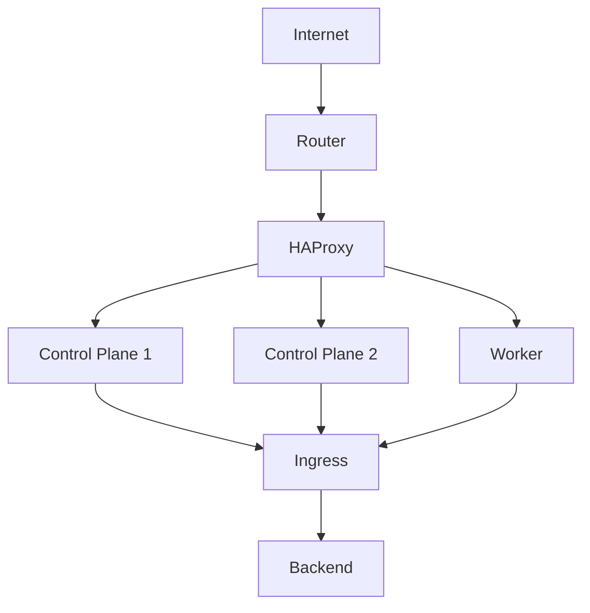

# Platform Architecture

## Overview

`jdwlabs/platform` is a tenant-centric GitOps repository managing Kubernetes applications via ArgoCD ApplicationSets
with explicit tenant boundaries, namespace isolation, and resource controls.

## Repository Layout

```
platform/
├── bootstrap/        # ArgoCD ApplicationSets and AppProjects
├── platform/         # Shared infrastructure apps (cluster-wide)
├── tenants/          # Per-tenant app configs and manifests
├── helm-charts/      # Custom Helm charts
└── docs/             # Documentation
```

## ArgoCD Model

### Governance ApplicationSet (`bootstrap/governance-appset.yaml`)

- Scans `tenants/*/tenant.yaml` via git file generator
- Renders `helm-charts/tenant-envelope` for each tenant
- Creates namespaces, quotas, limit ranges, network policies, AppProjects
- Generates per-tenant `<name>-services` and `<name>-deployments` ApplicationSets
- Services ApplicationSet deploys from Helm chart + values ref + optional postInstall raw manifests
- Deployments ApplicationSet (if `deploymentRepo.url` set) deploys from the tenant's deployment repo
- Automated sync with prune and self-heal

### Deployments ApplicationSet

When a tenant defines `deploymentRepo.url` in their `tenant.yaml`, the `tenant-envelope` chart generates a
`<tenant>-deployments` ApplicationSet. This enables tenants to manage their own application deployments in a separate
Git repository.

The ApplicationSet uses a **matrix generator** combining:

1. **Git file generator** scanning `argocd/*/config.yaml` in the deployment repo (one file per environment)
2. **List generator** expanding the `apps` array from each matched config file

Each entry in `apps` becomes an ArgoCD Application named `<tenant>-<name>`.

#### Deployment repo structure

```
<deploymentRepo>/
├── argocd/
│   ├── non/
│   │   └── config.yaml  # Defines apps for non environment
│   └── prd/
│       └── config.yaml  # Defines apps for prd environment
└── charts/
    └── <chart-name>/
        ├── Chart.yaml
        ├── templates/
        ├── values.yaml        # Base values
        ├── values-non.yaml    # Non-prod overrides
        └── values-prd.yaml    # Prod overrides
```

#### Config file schema (`argocd/<env>/config.yaml`)

```yaml
apps:
  - name: <name>                   # Used in Application name: <tenant>-<name>
    namespace: <target-ns>         # Must be a namespace the tenant owns
    chartPath: charts/<chart>      # Path to chart in the deployment repo
    syncWave: "0"                  # Default ordering (default: "0")
    valueFiles: # Helm value files relative to chartPath
      - values.yaml
      - values-<env>.yaml
```

Sync options applied to all deployment repo apps: `CreateNamespace=false`, `PruneLast=true`, `ServerSideApply=true`.

## Sync Wave Ordering

| Wave | Category            | Apps                                                               |
|------|---------------------|--------------------------------------------------------------------|
| 0    | Bootstrap           | argo-cd (self-management)                                          |
| 1    | Core infrastructure | cert-manager, ingress-nginx, longhorn                              |
| 2    | Platform services   | vault, external-secrets, monitoring, grafana, atlas-operator, etc. |
| 3    | Operators           | cnpg-operator, arc-systems                                         |
| 4    | Shared databases    | postgresql-cluster-non, postgresql-cluster-prd, db-ui              |
| 5    | Tenant workloads    | ARC runner sets, Atlas schemas                                     |

## Namespace Strategy

- Platform namespaces: original names (`vault`, `argocd`, `monitoring`, etc.)
- Tenant namespaces: `<tenant>-<purpose>` (e.g. `jdwlabs-runners`, `dotablaze-tech-runners`)
- Database namespace: shared `database` (CNPG clusters platform-tier)

## Secret Management

- Vault at `http://vault.vault.svc.cluster.local:8200`
- ClusterSecretStore named `vault` for platform-wide access
- Vault KV paths: `kv/platform`, `kv/jdwlabs`, `kv/dotablaze-tech`
- ExternalSecret CRs in each namespace pull from ClusterSecretStore

## Infrastructure Stack

| Component                   | Purpose                                            | Namespace        |
|-----------------------------|----------------------------------------------------|------------------|
| cert-manager                | TLS certificates via Let's Encrypt + Porkbun DNS01 | cert-manager     |
| ingress-nginx               | Ingress controller (NodePort via HAProxy)          | ingress-nginx    |
| Longhorn                    | Distributed block storage                          | longhorn-system  |
| Vault                       | Secret management                                  | vault            |
| ESO                         | External Secrets Operator                          | external-secrets |
| ArgoCD                      | GitOps continuous delivery                         | argocd           |
| CNPG                        | CloudNativePG database operator                    | cnpg-system      |
| Atlas                       | Database schema migration operator                 | atlas            |
| ARC                         | GitHub Actions Runner Controller                   | arc-systems      |
| Prometheus + Grafana + Loki | Observability stack                                | monitoring       |

## Traffic Routing

### Overview

All external traffic enters the cluster through a single path: DNS resolves to the
router's public IP, the router NATs to HAProxy, and HAProxy laod-balances across
Kubernetes nodes via NodePort.

```
┌─────────────────────────────────────────────┐
│                  Internet                   │
└─────────────────────────────────────────────┘
                       │                       
              DNS: *.jdwlabs.com               
              CNAME ➜ jdwlabs.com              
            A ➜ <router public IP>             
                       │                       
                       ▼                       
┌─────────────────────────────────────────────┐
│          Router (NAT/Port Forward)          │
│                                             │
│             :80  ➜ <haproxy>:80             │
│            :443 ➜ <haproxy>:443             │
└─────────────────────────────────────────────┘
                       │                       
                       ▼                       
┌─────────────────────────────────────────────┐
│       HAProxy (Static IP, bare-metal)       │
│                                             │
│         :80/:443  ➜  ingress-nginx          │
│         :6443     ➜  Kubernetes API         │
│           :50000    ➜  Talos API            │
│         :9000     ➜  HAProxy stats          │
└─────────────────────────────────────────────┘
                       │                       
        ┌──────────────┼──────────────┐        
        │              │              │        
        ▼              ▼              ▼        
┌─────────────┐ ┌─────────────┐ ┌─────────────┐
│   Control   │ │   Control   │ │    Worker   │
│    Plane    │ │    Plane    │ │    Node     │
│             │ │             │ │             │
│ :30080 HTTP │ │ :30080 HTTP │ │ :30080 HTTP │
│ :30443 HTTPS│ │ :30443 HTTPS│ │ :30443 HTTPS│
│ :6443  K8s  │ │ :6443  K8s  │ │             │
│ :50000Talos │ │ :50000Talos │ │             │
└──────┬──────┘ └──────┬──────┘ └──────┬──────┘
       │               │               │       
       └───────────────┼───────────────┘       
                       │                       
             kube-proxy (iptables)             
               routes to pod IP                
                       │                       
                       ▼                       
┌─────────────────────────────────────────────┐
│              ingress-nginx Pod              │
│           (Deployment, 1 replica)           │
│                                             │
│               Terminates TLS                │
│           Routes by Host header:            │
│                                             │
│         argocd.jdwlabs.com   ➜ :443         │
│         vault.jdwlabs.com    ➜ :8200        │
│          grafana.jdwlabs.com ➜ :80          │
└─────────────────────────────────────────────┘
                       │                       
                       ▼                       
┌─────────────────────────────────────────────┐
│             Backend Service Pod             │
│         (argocd, vault, grafana...)         │
└─────────────────────────────────────────────┘                          
```



### How each layer works

**DNS (Porkbun)**

- `jdwlabs.com` A record ➜ router's public IPv4
- `*.jdwlabs.com` CNAME ➜ `jdwlabs.com` (all subdomains inherit the A record)
- TLS certificates issued by Let's Encrypt via cert-manager DNS01 challenge (Porkbun webhook)

**Router**

- NAT/port-forwards TCP :80 and :443 to the HAProxy static IP
- Only two ports needed for all HTTP/HTTPS services

**HAProxy**

- Central entry point for all cluster traffic (static IP, bare-metal VM outside the cluster)
- IP is configured via `haproxy_ip` in terraform.tfvars
- HTTP/HTTPS frontends use TCP mode with PROXY protocol (`send-proxy`) so ingress-nginx sees real client IPs
- Health checks each backend node - if a node goes down, traffic is automatically rerouted
- Config is auto-generated and reloaded by `talops reconcile` whenever nodes are added or removed

**NodePort (ingress-nginx)**

- `service.type: NodePort` with fixed ports: `:30080` (HTTP), `:300443` (HTTPS)
- Kubernetes opens these ports on **every node** in the cluster
- kube-proxy on each node maintains iptables rules that DNAT traffic to the ingress-nginx pod, regardless of which node
  the pod runs on
- Single-replica Deployment (not DaemonSet) to conserve resources - kube-proxy handles cross-node routing

**ingress-nginx**

- Terminates TLS using certificates from cert-manager
- Routes requests to backend services based on the `Host` header and Ingress rules
- Uses PROXY protocol to decode real client IPs from HAProxy

### Kubernetes API access

The Kubernetes API follows a separate path through HAProxy:

```
kubectl ➜ cluster.jdwlabs.com:6443
  ➜ HAProxy :6443 ➜ control-plane-1:6443
                  ➜ control-plane-2:6443 (leastconn balancing)
                  ➜ control-plane-3:6443
```

Talos nodes resolve `cluster.jdwlabs.com` to the HAProxy IP via static `/etc/hosts`
entries injected by the machine config (`extraHostEntries`).
